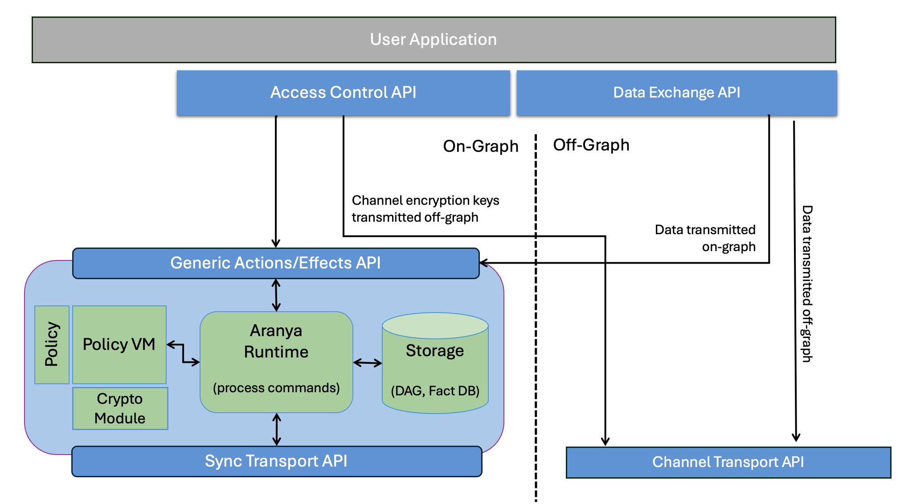
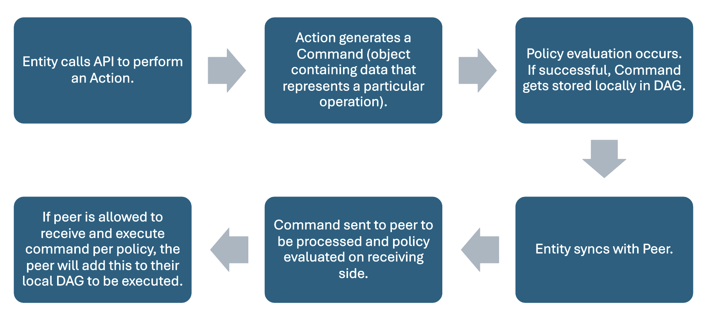
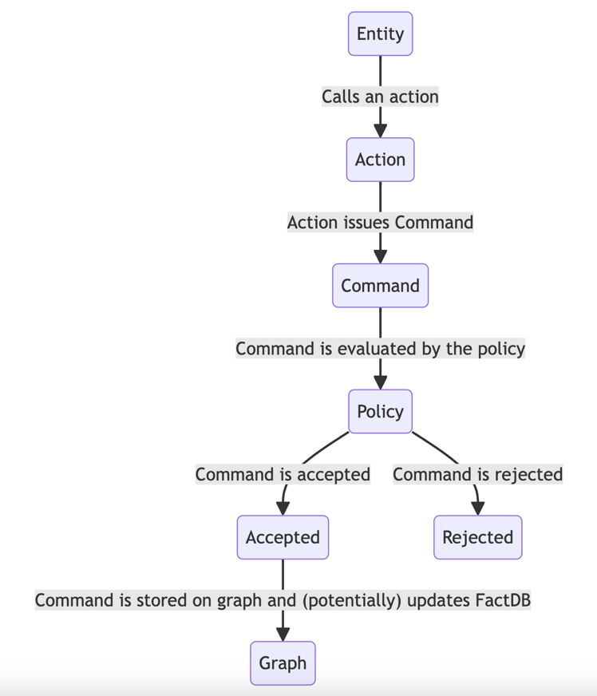
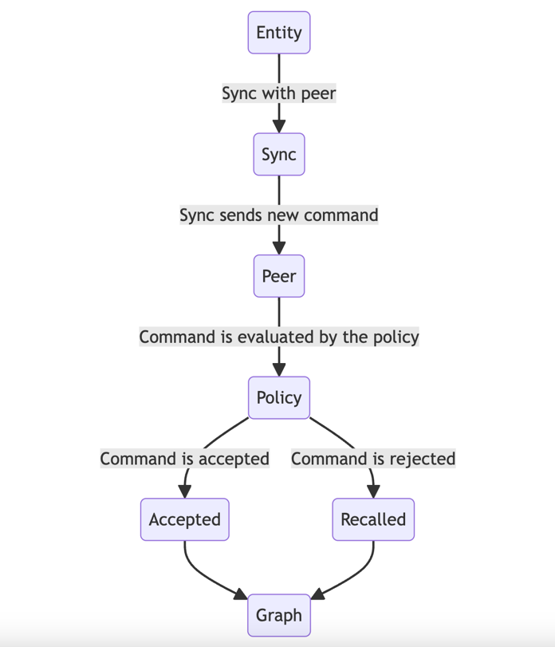
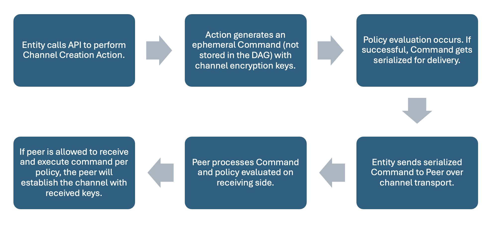
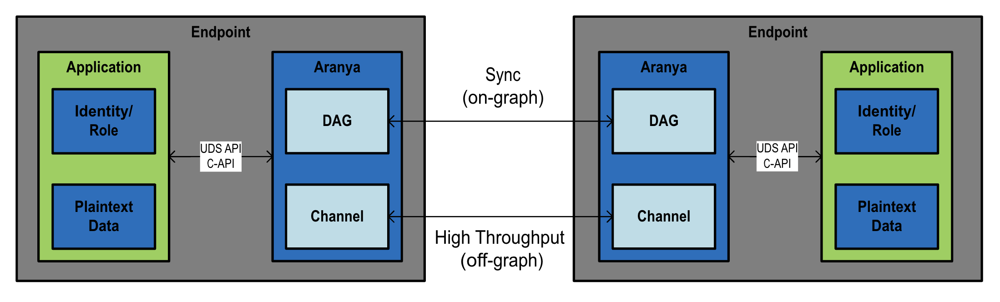

# ARANYA OVERVIEW

**Table of Contents**

- [ARANYA OVERVIEW](#aranya-overview)
- [What is Aranya?](#what-is-aranya)
- [What can I use Aranya for?](#what-can-i-use-aranya-for)
    - [Terminology](#terminology)
    - [Capabilities](#capabilities)
- [Aranya Platform](#aranya-platform)
  - [Deployment Ecosystem](#deployment-ecosystem)
    - [Designed for Embedded Device Support](#designed-for-embedded-device-support)
    - [Supported Platforms](#supported-platforms)
- [Aranya Architecture](#aranya-architecture)
  - [Technical Overview](#technical-overview)
  - [Control Plane vs. Data Plane](#control-plane-vs-data-plane)
    - [Control Plane](#control-plane)
    - [Data Plane](#data-plane)
- [Using Aranya](#using-aranya)
  - [Decentralized Peer-to-Peer Data Exchange](#decentralized-peer-to-peer-data-exchange)
  - [Data Segmentation](#data-segmentation)
  - [Key Management](#key-management)
- [Appendix](#appendix)
  - [Glossary](#glossary)

# What is Aranya?

Aranya is an **access governance and secure data exchange platform for organizations to control their critical data and services**. Access governance is a mechanism to define, enforce, and maintain the set of rules and procedures to secure your system's behaviors. 

Aranya enables you to **safeguard sensitive information, maintain compliance, mitigate the risk of unauthorized data exposure, and grant appropriate access.** Aranya's decentralized platform allows you to define and enforce these sets of policies to secure and access your resources.

The platform **provides a software toolkit** for policy-driven access controls and secure data exchange. The software is deployed on endpoints, integrating into applications which require granular access controls over their data and services. Endpoints can entrust Aranya with their data protection and access controls so that other applications running on the endpoint need only to focus on using the data for their intended functionality.

A key discriminating attribute of Aranya is the decentralized, zero trust architecture. Through the integration of the software, access governance is implemented without the need for a connection back to centralized IT infrastructure. With Aranya's decentralized architecture, if two endpoints are connected to each other, but not back to the cloud or centralized infrastructure, **governance over data and applications will be synchronized between peers** and further operations will continue uninterrupted.

# What can I use Aranya for?

-   **Secure Sensitive Data:** Ensure your data is secured from unauthorized access or potential breaches using cryptographic algorithms to encrypt the data.

-   **Data Protection and Privacy:** Granular controls which can grant or revoke access, defined through policy that dictate whether an entity can or can't access data.

-   **Secure Data Exchange:** Enable unidirectional or bidirectional secure data exchange between two devices without the need for access to any form of centralized IT infrastructure.

-   **Data Integrity/Provenance:** Access activity logs provide transparency on data's integrity, ensuring your data has not been compromised or manipulated.

### Terminology

The following terms will be used throughout this document to describe Aranya deployments on **endpoints.** These deployments, or **instances,** are further defined as specific **entities,** or devices, once the instance is assigned a specific set of cryptographic keys used for identity and authentication and are governed by written **policy**.

**Endpoint:** A piece of hardware (e.g. IoT device, computer, cellular phone, etc.) or software (e.g. application) on which Aranya is integrated.

**Instance:** A single deployment of the Aranya software. To note, each endpoint can have one or many instances deployed on it.

**Entity:** You can think of this as a specific device identity and it is used to identify an instance by assigning it a set of cryptographic keys used for identity and authentication, allowing it to govern the behavior of the endpoint.

**Policy:** Defines specific behaviors, or accepted actions with corresponding commands, that will be generated and executed on the endpoint.

### Capabilities

Aranya provides the following capabilities in a single, low size, weight, and power (SWAP) software platform, key to your organization's access governance:

-   **Identity & Access Management (IdAM)**

    -   **RBAC (Roles):** Entities, or a group of entities, are given permission to interact with data or applications based on pre-defined roles.

    -   **ABAC (Attributes):** Entities, or a group of entities, can be given permission to interact with data or applications based on dynamic attributes.

    -   **Revocation:** Entities or whole RBAC/ABAC roles can be removed from access just as easily as it is to grant access.

-   **Decentralized Peer-to-Peer Messaging**

    -   Enable secure data exchange between two endpoints without the need for access to any form of centralized IT infrastructure.

-   **Key Management**

    -   Aranya leverages the crypto module that is implemented and configured on the endpoint to perform cryptographic functions used by policy commands. This means that an authority model can be designed to utilize the crypto module for generating, storing, and/or distributing cryptographic keys securely and in accordance with the governing policy, enabling dynamic key management.

-   **Data Segmentation**

    -   Data can be segmented based on pre-defined roles or attributes through topic labels. For example, certain roles may be restricted from gaining access to a topic and other roles may be prerequisites for gaining access. In addition to roles, any attribute stored about the entity may be used to control access to a topic.

-   **Audit Log of Immutable Commands**

    -   Using the Control Plane (described below), Aranya provides a high-assurance audit log of all commands, or instructions given by an entity to perform a specific task, providing data integrity and provenance for the movement of your data throughout your infrastructure.

    -   The native data structure _is_ the audit log of all commands. The log, which is distributed and synchronized across all endpoints, provides a cryptographically authenticated, tamper-evident, high-assurance replication of all commands taken.

    -   For each verified command, a cryptographic hash is created. If a previous event has been modified, the current one will no longer be valid due to the hash changing.

# Aranya Platform

## Deployment Ecosystem

The Aranya platform is hardware and software agnostic and is designed to be built for a wide variety of platforms. The software is link-agnostic, meaning it could work with any transport protocol over trusted (single) or mixed (multiple) networks.

### Designed for Embedded Device Support

-   Lightweight platform: <1.5 MB Binary and <1.5 MB RAM

-   100% built in Rust, a safety-first, high-level programming language

### Supported Platforms

Platforms where Aranya was built/tested in CICD:
- `linux/arm`
- `linux/arm64`
- `linux/amd64`

Platforms where Aranya was built/tested in development:
- `macos/arm64`

Note: we are working on transitioning our CICD pipeline to github.com and hope to provide more build artifacts for download soon.

# Aranya Architecture

As Aranya provides both access governance and secure data exchange, it analogously uses 2 familiar networking concepts, a **control plane** and **data plane**, to separate its core functionality between relevant components of the system.

**Control Plane:** The Aranya control plane is the logical element of the system that handles administrative functionality needed to govern _access control operations defined in the policy_. It is used to manage and enforce the authority model by carrying out only operations that conform to the defined policy and validating them according to cryptographic credentials. For example, it will be the mechanism used to perform commands such as adding devices or setting up a secure data exchange channel.

**Data Plane:** Similarly, Aranya defines the data plane as what provides the primary function for the data to _securely exchange and encrypt that data end-to-end between two connected peer nodes_. The data plane is also subject to the permission system specified by the underlying policy; messages can only be sent/received by peers that have been given the appropriate credentials (e.g., cryptographic keys), which can typically require some set of permissions be explicitly granted first. For example, **the Aranya Fast Channels (AFC) feature (see off-graph components below)** enables an endpoint to send encrypted data to another endpoint as long as both endpoints are assigned to the same attribute, called "label", which is managed by the policy. 

## Technical Overview

The components of Aranya come together to enable the control plane and data plane as needed, with the help of a built-in daemon, according to the underlying policy. For instance, the control plane needs a mechanism for tracking different access control operations so that it can determine how newly received operations should be executed. For this, Aranya includes a Directed Acyclic Graph (DAG) which stores policy commands at its nodes, in an immutable and verifiable format, and a Fact Database (FactDB) that keeps key-value pairs of information regarding the executed operations. These components make up the storage module that the control plane relies on for keeping track of previous executions, representing its current state, and assessing the authorization of new executions.  

To ensure that participating entities are acting over a common authoritative state, the control plane also utilizes the component of the system that performs graph synchronization of operational state, which is supplied through the sync transport API. The built-in daemon will expose the appropriate API calls to connect the underlying components of Aranya.

Other core components of our system that enable the control plane and data plane functionalities are detailed below and can be seen in Figure 1 below.

_Figure 1: System Architecture Overview Diagram_

**On-Graph Components:**

-   Pre-defined **policy** that contains the set of roles and permissions which make up the authority model.

-   **Crypto Module** that is used to perform all cryptographic functions without exposing sensitive material outside its domain. The system leverages a set of cryptographic protocols where the underlying algorithms are configurable up to NIST standard requirements for security. The system leverages whichever crypto is configured and does not provide the cryptographic cipher suite.

-   **Virtual Machine (VM) for executing the policy** and connecting it to the cryptographic module.

-   **Aranya Runtime** which connects your application and all other external components together for passing data and commands. The application will perform its functional operation leveraging the Aranya APIs. The Aranya instance will route API calls to the Policy VM for execution, and any commands published by an action will be provided back to the device for storage. If any effects are emitted by the commands, they too will be provided to the device to be sent back to the user application via the APIs.

Aranya Runtime performs similar routing to handle peer-to-peer communication through the Sync API.

-   **Storage component (DAG and Fact DB)** to hold executed operations that have been validated and added to the audit log.

-   **Set of APIs for the device to perform or exchange policy operations.**

    -   Generic Actions/Effects API

    -   Sync Transport API

**Off-Graph Components:**

-   **Aranya Fast Channels (AFC)** High throughput, low latency **network channels for exchanging data between endpoints.**

-   **Shared Local Memory** to hold the **channel keys** for AFC, used for encrypting and/or decrypting data.

-   **Crypto Module** that is used to perform all cryptographic functions without exposing sensitive material outside its domain.

-   **Set of APIs to send and receive data** or **compute new channel keys.**

    -   Channel Transport API

_Note:_ The control plane and data plane may utilize different on or off-graph components to execute tasks they are responsible for. For example, while the data plane may mostly use the off-graph approach for handling secure message exchanges in real-time, off-graph messaging does not inherently provide an immuable record of the commands. There may be scenarios where the message being sent must be captured by an immutable/verifiable command that is tracked against the authority state. This would grant usage of on-graph handling of messages by the data plane. 

## Control Plane vs. Data Plane

The next two sections will lay out the foundational knowledge of the control plane and data plane which will be helpful to better understand how they interact within the system and the capabilities that each of them provides.

### Control Plane

The Aranya control plane is the heart of its access governance solution. It is where the defined policy is stored and executed to provide the functionality needed to enforce the set of roles, permissions, and requirements it outlines. The policy file is fully customizable to allow each organization to explicitly define the authority model that best suits their needs to control access to resources with as much granularity as they may need.

The policy contains the full set of operations that devices can perform in the system and specifies the permission requirements for each. These operations are denoted by data structures, known to Aranya as "Commands." Each command is essentially a piece of data that defines an operation and embeds into it the set of requirements needed to perform it. Hence, executing a command will carry out the operation it defines, and storing it will make up the audit log of authority model operations.

The distributed data is stored as commands in a Directed Acyclic Graph (DAG) which is updated via a policy. The policy outlines the different commands, actions, and effects which define the objects, operations, and validity checks for those operations to update the state of the graph.

All endpoints participating in the graph will receive all updates to the graph regardless of whether that command is relevant to that endpoint. This property allows commands to propagate asynchronously and opportunistically across the sync network to reach its intended destination through all available transport paths, but also imposes a cost in terms of network bandwidth and processing on each node for each command. Therefore, on-graph messages are limited to 100’s of messages per second, limited by available aggregate transport bandwidth and processing performance of the slowest endpoints on the DAG.

**Workflow**

The general workflow for exchanging control plane commands on-graph across two endpoints can be seen below in Figure 2. This workflow assumes a policy has been written and validated for all actions desired in the architecture.

_Figure 2: General On-Graph Workflow_

**Directed Acyclic Graph (DAG)**

The DAG is a decentralized record of all commands that are replicated and shared between endpoints over the peer-to-peer network managed by an entity's application on the endpoint. Aranya records each command using a DAG. We think about the graph in the way a tree grows - from the root to the tip of each branch - and how that tree grows over time to explain how a record of entity activity is created, and data is shared over time. Each time an entity operates on or shares new data, the historical record is changed.

Since not all endpoints will always be in communication, these records and data storage are not linear. For instance, an endpoint may reset and will need to sync/integrate data with other entities. Hence, a new branch is created for operations performed by disconnected endpoints that are working in parallel and a sync between any two such endpoints will result in a new node on the graph that joins the two branches to represent a merged state.

Aranya uses an ordering algorithm to produce a sequential ordering of commands. Conflict resolution becomes important for determining the order in which to execute commands received from syncing. Aranya uses its ordering algorithm on top of the policy to determine which command to prioritize to produce a linear sequence of commands.

The algorithm is deterministic and can be somewhat compared to a consensus algorithm approach. It builds this linear sequence of commands from the DAG, but it does not change how data is represented in the DAG. The purpose of the linear sequence is to define an eventually consistent state across the system. Thus, the state of the system is denoted as the output of the ordering algorithm.

**Policy**

To execute actions, a custom policy file must be written and validated prior to deployment. Policies outline the accepted actions that can be issued and the corresponding commands that will be generated. Successful commands will emit effects and/or write facts (stored key value pairs) to the graph. The following is a basic overview of the parts that make up a policy.

-   **Action**: Actions are an application's entry point into the policy. They are functions that can perform entity checks and publish commands into the local database. When new commands arrive (from either local creation, or synced from other nodes), the policy for those commands is evaluated, which may produce fact changes and effects. Actions are, alongside effects, part of the application interface implemented by the policy. Actions execute atomically - they only succeed if all the commands they produce succeed.

-   **Command**: A command defines structured data, methods for packing and unpacking this data, and policy decisions for processing data.

-   **Effect**: Effects are structured data emitted by policy, which communicate changes and status from the policy to the application. The outcome of an effect is defined by policy.

-   **Fact**: A fact is a key value pair stored in the Fact Database. The shape of a fact is defined via policy with fact schema statements.

To make changes to a graph, an entity calls an action to generate one or more commands. Another way to think about commands is to envision a piece of data (or fact) that you can manipulate by calling an action. The action is merely the "act" you wish to perform on the data and the command holds the actual execution of this action. Both actions and commands can be implemented on raw data if that data is passed to the action. For example, an action may be adding/removing entities, creating/deleting channels, or sending encrypted data. Once an action is called, the generated command is then evaluated by the policy engine to determine its validity given the current state and loaded policy.

If a command is valid, it may be stored on the graph and some facts may be added, updated, or removed in the fact database. An effect, which provides information at the application level about the operation that was performed, can also be produced when a command is published. Upon syncing, all other peers may see the new validated command on the DAG. If they are authorized to view its contents, such as an encrypted message, then they will be able to obtain that too.

**Fact Database**

Information relevant to the system can be stored as a key/value pair, called a "fact." Facts are stored in the Fact Database and can only be created or mutated by a command. Executing a series of commands will produce a set of facts that depends on the order of execution, that is, if the commands are executed in a different order, they could result in a different set of facts.

Policy evaluation in Aranya relies on the set of facts stored in the fact database to determine whether an operation defined by a command should be permitted to occur. If evaluation is successful, then the command gets fully executed and stored in the DAG. Otherwise, the command may be either rejected or recalled. Both an accepted and a recalled command can change or modify the fact database, however rejected commands never change facts. Rejected commands, therefore, are never added to the graph and are never executed.

**Calling an Action**

To call an Action, the entity will follow the following process:

_Figure 3: Calling an Action Workflow_

**Syncing with a Peer (other entity)**

To sync with a peer or other entity using Aranya, the entity will follow the following process:

_Figure 4: Syncing with a Peer Workflow_

### Data Plane

The control plane provides the full functionality to implement and enforce the authority model used to govern resource accesses, which includes the transmission of data representing the operations that devices perform by utilizing the sync protocol. Since the sync protocol is designed to work with the DAG to keep a decentralized record of every command, it can have some overhead that increases the latency and may not be the most optimal choice for communicating data real time.

As an alternative, Aranya's data plane may be selected to transmit data securely using end-to-end encryption that is bound to the specific entities as defined by the authority model of the policy in the control plane. An API is provided for this low latency, high throughput data exchange (compared to on-graph) by exposing lightweight channels to applications on the endpoints.

Channels are governed by the authority model defined by the policy. Entities can be incorporated in as many channels as desired. Aranya manages cryptographic keys, leveraging the configured cipher suite for encrypting and decrypting messages on a per-channel basis. Aranya uses the crypto engine to negotiate keys while data is transmitted efficiently off-graph, i.e., without being stored in a command that is added to the DAG. Because the commands are not stored in the DAG, these channels are useful where large messages, network streams, or other high-throughput data must be sent to peers.

Aranya will still leverage the DAG for managing the keys used for authentication. Data segmentation of channels is achieved using topic labels. Encryption is scoped to each channel, which supports one-to-one communication in either a unidirectional or bidirectional manner. The encryption/decryption algorithms provided by the crypto engine are symmetric and facilitate fast communication that is compatible with low resource environments such as embedded systems.

**Workflow**

**Creating a Channel**

A channel is used to group together a fixed number of devices based on specific roles or attributes. User IDs identify the endpoints of the channel, and the topic label is an additional attribute available to write policies against. To create a channel, an entity will generate an ephemeral command. An ephemeral command is one that utilizes the same policy as all other commands, but which is never added to the DAG that audits them. Instead, entities transmit the command through an external transport mechanism. An ephemeral command is part of an ephemeral session, meaning it does not persist to the graph, but is still evaluated by the associated policy. The ephemeral command used as part of the setup includes the information required for the peers to set up the encryption keys that will be used for the channel.

Once the command is validated, the crypto engine generates an encryption key associated with the entity and exposes it through shared memory. If the channel is specified as unidirectional, the entity creating the channel is only assigned an encryption key. If the channel is bidirectional, the entity will also be assigned a decryption key. Aranya stores the key(s) in its own database and associates the key or key pair with this specific channel for this specific entity. After the channel creator's keys have been assigned, a "create channel" command is sent to the specified receiver. Like the process for the initial sender entity, the command is processed by the receiver's associated policy and the crypto engine generates a decryption key (if unidirectional), or encryption/decryption keys (if bidirectional). After the sender and receiver have both processed the "create channel" command, they are free to send and receive messages over their new channel and no further messages will be processed by their policy.

_Figure 5: Workflow when creating a Channel_

**Sending Data**

To send data over the channel, an entity will prepare the bytes to submit to the API to be encrypted. Aranya will retrieve the encryption key associated with the intended channel (stored in Shared Local Memory) and encrypt the message using the crypto engine. The user-defined transport method is then used to transmit the message to the receiver. Once the message has been received, Aranya will retrieve the entity's decryption key associated with this channel and use the crypto engine to decrypt the message. If a user's encryption or decryption key associated with the channel cannot be found, then the entity cannot encrypt or decrypt the message.

While channels are one-to-one, a policy may define rules for an entity to send messages to multiple other entities over individual channels. This is facilitated by topic labels, which are defined in a policy and act on the permission system. A label is assigned to entities that want to communicate under a specific topic and a channel can only be created for entities assigned to that same topic. Labels cannot be used to send a message to more than one entity as they are specifically used by policy to allow two entities to talk to each other using that label (if both points have that label assigned to them).

_Figure 6: Workflow to Send Data on a Channel_

# Using Aranya

The Aranya Platform functionality includes a fully customizable authority model and secure data exchange that can be implemented to provide the security, accountability, efficiency, and resiliency organizations need to protect their most important resources within a decentralized, disrupted environment. Some of these uses include:

1.  **Decentralized Peer-to-Peer Data Exchange**

2.  **Data Segmentation**

3.  **Key Management**

## Decentralized Peer-to-Peer Data Exchange

Aranya provides interfaces for secure peer-to-peer data exchange, guaranteeing data delivery between endpoints, without the need for a centralized infrastructure governing your data. There are two ways data can be exchanged between endpoints:

1.  **Low-Throughput Broadcast (On-Graph):** Guaranteeing eventual delivery of your data to your endpoints through perpetuated syncing between peers to create a consistent end state. This broadcast can be one endpoint to one endpoint or one-to-many endpoints.

2.  **High-Throughput (Off-Graph):** Lowest latency, bulk encryption of your data through secure channels.

Figure 7 below outlines the data flow between two endpoints, both with an Aranya instance and an application which will utilize the data. The two instances will leverage any transport that has been configured between the endpoints to exchange data via either the sync protocol (on-graph) or a high-throughput data exchange (off-graph), both defined below.

_Figure 7: Endpoint Integration Overview Diagram_

The attributes governing the use of on-graph and off-graph, and when each would be best to use, can be seen in Table 1 below.

<table>
<colgroup>
<col style="width: 42%" />
<col style="width: 30%" />
<col style="width: 26%" />
</colgroup>
<thead>
<tr>
<th style="text-align: center;"><strong>Feature</strong></th>
<th style="text-align: center;"><strong>On-Graph</strong></th>
<th style="text-align: center;"><strong>Off-Graph</strong></th>
</tr>
</thead>
<tbody>
<tr>
<td>
<strong>Primary Use</strong>

(Core Functionality)
</td>
<td>Control plane (Aranya commands)</td>
<td>Data plane (data)</td>
</tr>
<tr>
<td>
<strong>Secondary Use</strong>

(Other ways to use the core functionality in addition to main intention which may be advantageous for your use case)
</td>
<td>Limited Data plane messages (commands with embedded data)</td>
<td>Channel Control messages (ephemeral commands)</td>
</tr>
<tr>
<td><strong>Distribution</strong></td>
<td>Broadcast across all sync connections (mesh and multi-hop support)</td>
<td>Point-to-point (no multi-hop)</td>
</tr>
<tr>
<td><strong>Throughput</strong></td>
<td>Low throughput (100s of messages/sec depending on available transport and size of network)</td>
<td>High throughput (limited by transport)</td>
</tr>
<tr>
<td><strong>Latency</strong></td>
<td>Higher latency due to overhead of graph operations</td>
<td>Low latency</td>
</tr>
<tr>
<td><strong>Direction</strong></td>
<td>Unidirectional (two unidirectional sync connections used to sync bi-directionally)</td>
<td>Unidirectional</td>
</tr>
<tr>
<td>
<strong>Message Encryption</strong>

(Application Layer)
</td>
<td>Optional (note, transport layer may provide its own encryption)</td>
<td>Automatic</td>
</tr>
<tr>
<td><strong>Resilience/Recovery</strong></td>
<td>Highly resilient</td>
<td>No built-in recovery other than what is provided by underlying transport</td>
</tr>
<tr>
<td><strong>Authorization</strong></td>
<td>Asymmetric keys</td>
<td>Symmetric key</td>
</tr>
<tr>
<td><strong>Authentication</strong></td>
<td>Per message</td>
<td>Per message</td>
</tr>
</tbody>
</table>

_Table 1: Attributes of On-Graph vs. Off Graph Data Exchange_

## Data Segmentation

Data segmentation is enabled through topic labels, segmenting the data based on specific topics governed by the same policy. As described in the previous section, channels created for off-graph messaging include a topic label in its definition. Channels are created using ephemeral commands which are evaluated by policy. Therefore, policies may be written that govern how topic labels are shared. For example, certain roles may be restricted from gaining access to a topic and other roles may be prerequisites for gaining access. In addition to roles, any attribute stored about the user may be used to control access to a topic.

## Key Management

Aranya leverages whichever crypto module is currently implemented and configured on the endpoint. Keys are then derived from the current authority model, defined over specific data channels. Data channels are a segmentation of entities that can exchange end-to-end encrypted data according to the authority model's pre-defined established permissions. Aranya's crypto engine generates an encryption key associated with the entity. If the channel is specified as unidirectional, the entity creating the channel is only assigned an encryption key. If the channel is bidirectional, the entity will also be assigned a decryption key. The key, or key pair, are stored locally in its own database and associates the key or key pair with this specific channel for this specific entity. After the channel creator's keys have been assigned, Aranya sends the "create channel" command to the specified receiver. Like the process for the initial entity, the command is processed by the receiver's associated policy and the crypto engine generates a decryption key (if unidirectional), or encryption/decryption keys (if bidirectional).

Aranya also enables revocation. Specific entities, or whole RBAC/ABAC roles, can be removed from access to data as easily as it is to add them. In addition, revocation can be retroactive if needed, allowing the endpoint to remove a larger set of permissions as needed.

# Appendix

## Glossary

-   **Action:** An action is a generated function defined in the policy language that can affect state. Actions create new commands to be evaluated by the policy and, if valid, added to the graph. When new commands arrive (from either local creation, or synced from other nodes), the policy for those commands is evaluated, which may produce fact changes and effects. Actions can be thought of as providing a contract (along with effects) to the application which is implemented by the policy.

-   **Attribute-based Access Control (ABAC):** A version of Identity Access Management that uses attributes over defined roles to grant an entity or group of entities' permission(s) to interact with a graph.

-   **Audit and Monitoring**: Regularly review and monitor activities and detect suspicious behavior. Use network monitoring tools to track access patterns and machine learning algorithms to detect anomalies.

-   **Channel:** A channel is a segmentation of entities that can exchange end-to-end encrypted data according to the authority model's pre-defined established permissions.

-   **Command:** Instruction given by an entity to perform a specific task. It is the object that is sent and stored to denote individual actions by different entities, as defined possible by the policy. For example, it could be to add an entity to a team, whereby the command object itself indicates the action that was performed and other necessary information, such as the credentials of the newly added entity.

-   **Directed Acyclic Graph (DAG):** A directed graph with no directed cycles. That is, a graph of vertices and edges, with each edge directed from one vertex to another, such that following those directions will never form a closed loop.

-   **Effect**: An Effect is a struct used in policy finish and recall blocks to describe the shape of side effects produced from processed commands.

-   **Endpoint:** Where the Aranya software is deployed. This can be a piece of hardware (e.g. spacecraft payload, drone, cellular device, etc.) or software (e.g. application).

-   **Entity:** Represents an instance and has an identity associated to it, as well as other crypto material which govern how it behaves on the endpoint. An entity could be used to describe a specific user on the platform.

-   **Facts**: Key-value pair that is produced by evaluating a command.

-   **Graph**: Data structure of stored commands, where each command is connected by a line to the command that occurred immediately before it, as seen from the device's local state.

-   **Identity and Access Management (IDAM)**: (as defined by DOD): The combination of technical systems, policies and processes that create, define, and govern the utilization, and safeguarding of identity information.

-   **Instance:** Individual deployment of the Aranya software. A single endpoint can have one or many instances.

-   **Least Privilege Access:** This IDAM policy cornerstone gives devices and systems only the minimal access needed to perform their tasks, reducing the risk of unauthorized access or activities.

-   **Peer to Peer**: Allows computers to share access by acting as a server for each other.

-   **Policy**: A written document that defines all the permitted actions, commands, effects, validity checks, side-effects, facts, etc. Policies are customizable documents written in the domain specific language of the _Policy_ _Language_,

-   **Revocation**: Removal of access to a specific data set.

-   **Role-Based Access Control (RBAC):** A version of Identity Access Management that uses roles to grant a user or group of devices' permission(s) to interact with a graph.

-   **Segmentation**: Chunking specific data as part of processes.

-   **Segregation of Duties**: Responsibilities should be distributed among different individuals to prevent fraud or error. This is especially important in mesh networks, where one error can have significant consequences.

-   **Secure Authentication and Authorization:** Implement strong authentication methods and control what authenticated devices can do. Consider multi-factor authentication and digital certificates to ensure only authorized individuals have access.

-   **State:** All the information that defines how the software platform is currently functioning, how it can change, and how it should behave in different scenarios

-   **User Datagram Protocol (UDP):** UDP is a communication protocol that allows endpoints and applications to send data across a network without establishing a connection first.

-   **UDS:** Unix Domain Socket

-   **Zero-Trust:** A cybersecurity approach that requires all entities and devices to be authenticated and authorized before accessing data, endpoints, applications, and services.
